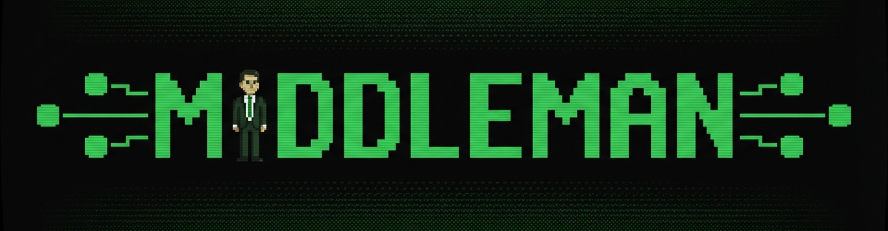
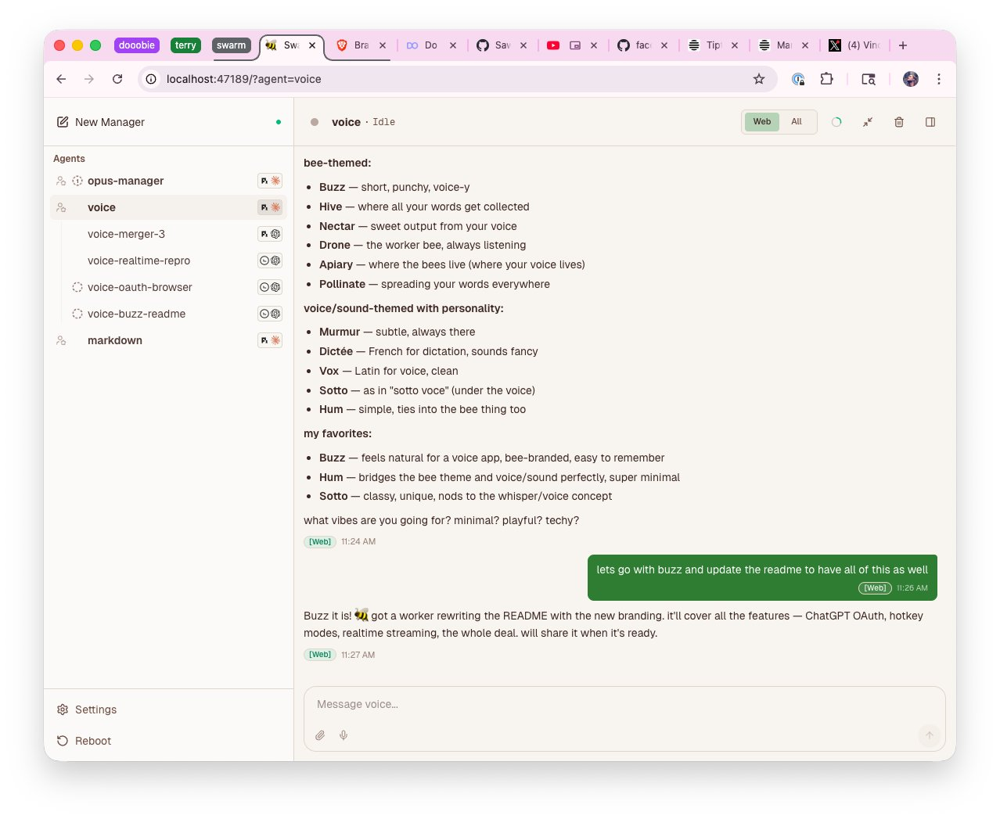

<p align="center">
  
</p>

# 👔 Middleman

A local-first multi-agent orchestration platform. One manager, many workers, zero tab-juggling.

If you're using agentic coding tools, you've probably hit this wall: you start with one agent, then two, then five. You're branching, worktree-ing, reviewing, merging, context-switching. The agents are cranking out code. But your entire day is spent *managing them*, sequencing work, checking output, nudging things along.

You're not an IC anymore. You've become a project manager. You need a middle manager.

**Middleman gives you one.** You talk to a single persistent manager agent per project. You describe what needs to be done, whether it's a feature, a batch of bug fixes, or a refactor, and the manager dispatches workers, parallelizes where it makes sense, and surfaces only the things that need your attention.



## Setup

```bash
git clone https://github.com/SawyerHood/middleman.git
cd middleman
pnpm i
pnpm prod:daemon
```

Open the UI, go to **Settings**, and sign in with your OpenAI or Anthropic key. Then create a new manager and start talking.

For development:

```bash
pnpm dev
# Backend: http://127.0.0.1:47187
# UI:      http://127.0.0.1:47188
```

## Key Features

- **Persistent managers.** Onboard once, work for days. Managers remember your preferences, workflow, and project context across sessions via compacting memory.
- **Worker dispatch.** The manager spawns workers (Codex, Pi/Opus, etc.) and routes messages between them. You describe work at a high level; it handles the breakdown.
- **Parallel execution.** Dump a list of tasks and the manager figures out what can run concurrently. Stream-of-thought voice dumps welcome.
- **Dashboard.** A Conductor-style UI for watching agents work, chatting with your manager, and managing settings.
- **Skills & integrations.** Built-in skills for web search, image generation, browser automation, cron scheduling, Google Workspace, and more. Extensible via the pi skill system.

## Architecture

Middleman is three things running on your machine:

```
┌─────────────────────────────────────────────┐
│  Dashboard UI (TanStack + Vite SPA)         │
│  Chat, agent status, settings, artifacts    │
└──────────────────┬──────────────────────────┘
                   │ WebSocket
┌──────────────────▼──────────────────────────┐
│  Backend Daemon (Node.js)                   │
│  HTTP + WS server, agent orchestration,     │
│  message routing, persistence, scheduler    │
└──────────────────┬──────────────────────────┘
                   │ spawns & messages
┌──────────────────▼──────────────────────────┐
│  Agents (pi / Codex)                        │
│  Manager → Workers → Merger                 │
│  Each in its own worktree                   │
└─────────────────────────────────────────────┘
```

- **`apps/backend`** is the daemon. HTTP + WebSocket server, swarm orchestration runtime, integrations, and scheduler.
- **`apps/ui`** is the dashboard. Real-time agent monitoring, chat interface, and settings management.
- The **manager agent** is built on [pi](https://github.com/badlogic/pi-mono), is event-driven, and never blocks. Always ready for the next message.

## How It Works in Practice

1. **Create a manager** for your project from the dashboard.
2. **Onboard it** by chatting. Tell it your preferred workflow, what tools to use, how you want work sequenced.
3. **Dump tasks** on it. A feature spec, a list of bugs, a vague idea. Voice or text.
4. The manager **spawns workers**, assigns tasks, and orchestrates execution in parallel where possible.
5. You **review** when you want, or let it roll.

## A Note

This is a vibecoded project. It's here to inspire, not to be a polished product. Fork it, tear it apart, or use it as a starting point to build your own middle manager.

## License

Apache-2.0
