# Swarm — Codebase Overview & Configuration Surface

> Generated from source code analysis. Last updated: 2025-02-20.

---

## Table of Contents

1. [Architecture Overview](#architecture-overview)
2. [Repository Layout](#repository-layout)
3. [Backend (`apps/backend`)](#backend)
4. [Frontend (`apps/ui`)](#frontend)
5. [Configuration Surface — Complete Inventory](#configuration-surface)
   - [Environment Variables](#environment-variables)
   - [File-Based Configuration](#file-based-configuration)
   - [Skills System](#skills-system)
   - [Archetypes System](#archetypes-system)
   - [Model Presets](#model-presets)
   - [Pi / Claude Code Auth Integration](#pi--claude-code-auth-integration)
   - [CWD Policy & Directory Allowlists](#cwd-policy--directory-allowlists)
   - [Package.json Scripts](#packagejson-scripts)
   - [Daemon & Production Infrastructure](#daemon--production-infrastructure)
   - [Swarm Tools (Agent-Facing)](#swarm-tools-agent-facing)
   - [WebSocket Protocol](#websocket-protocol)
   - [Data Directories & Persistence](#data-directories--persistence)

---

## Architecture Overview

```mermaid
graph TB
    subgraph "User Layer"
        USER["End User (Browser)"]
    end

    subgraph "Frontend — apps/ui (Vite + TanStack Start SPA)"
        UI_INDEX["IndexPage (routes/index.tsx)"]
        WS_CLIENT["ManagerWsClient (lib/ws-client.ts)"]
        AGENT_SIDEBAR["AgentSidebar"]
        MSG_LIST["MessageList"]
        MSG_INPUT["MessageInput"]
        CHAT_HEADER["ChatHeader"]
    end

    subgraph "Backend — apps/backend"
        subgraph "Entry & Transport"
            INDEX["index.ts (entrypoint)"]
            WS_SERVER["SwarmWebSocketServer (ws/server.ts)"]
            HTTP_SERVER["HTTP Server (/api/reboot)"]
        end

        subgraph "Core Orchestration"
            CONFIG["createConfig() (config.ts)"]
            SWARM_MGR["SwarmManager (swarm/swarm-manager.ts)"]
            AGENT_RT["AgentRuntime (swarm/agent-runtime.ts)"]
        end

        subgraph "Subsystems"
            ARCHETYPES["ArchetypePromptRegistry"]
            MODEL_PRESETS["Model Presets (pi-codex, pi-opus, codex-app)"]
            SWARM_TOOLS["Swarm Tools (spawn/kill/send/speak)"]
            CWD_POLICY["CWD Policy & Validation"]
            DIR_PICKER["Directory Picker (native OS)"]
        end

        subgraph "External (pi SDK)"
            PI_AUTH["AuthStorage (@mariozechner/pi-coding-agent)"]
            PI_MODEL_REG["ModelRegistry"]
            PI_SESSION["AgentSession (createAgentSession)"]
            PI_RESOURCES["DefaultResourceLoader"]
        end
    end

    subgraph "File System"
        ENV[".env"]
        SWARM_MD["SWARM.md (repo root)"]
        AGENTS_MD["AGENTS.md (repo root)"]
        MEMORY_MD["MEMORY.md (data dir)"]
        AGENTS_JSON["agents.json (data dir)"]
        SESSION_FILES["*.jsonl session files"]
        ARCHETYPE_BUILTINS["builtins/ (manager.md, merger.md)"]
        ARCHETYPE_OVERRIDES[".swarm/archetypes/ (repo)"]
        SKILL_BUILTINS["skills/builtins/ (memory, brave-search)"]
        SKILL_OVERRIDES[".swarm/skills/ (repo)"]
        AUTH_JSON["auth.json (pi auth)"]
    end

    USER -->|"Browser"| UI_INDEX
    UI_INDEX --> WS_CLIENT
    UI_INDEX --> AGENT_SIDEBAR
    UI_INDEX --> MSG_LIST
    UI_INDEX --> MSG_INPUT
    UI_INDEX --> CHAT_HEADER

    WS_CLIENT <-->|"WebSocket JSON"| WS_SERVER
    WS_SERVER --> SWARM_MGR

    INDEX --> CONFIG
    INDEX --> SWARM_MGR
    INDEX --> WS_SERVER
    CONFIG --> ENV

    SWARM_MGR --> AGENT_RT
    SWARM_MGR --> ARCHETYPES
    SWARM_MGR --> MODEL_PRESETS
    SWARM_MGR --> SWARM_TOOLS
    SWARM_MGR --> CWD_POLICY
    SWARM_MGR --> DIR_PICKER

    AGENT_RT --> PI_SESSION
    SWARM_MGR --> PI_AUTH
    SWARM_MGR --> PI_MODEL_REG
    SWARM_MGR --> PI_RESOURCES

    SWARM_MGR -->|"read"| SWARM_MD
    SWARM_MGR -->|"read"| MEMORY_MD
    SWARM_MGR -->|"read/write"| AGENTS_JSON
    SWARM_MGR -->|"read/write"| SESSION_FILES
    PI_RESOURCES -->|"read"| AGENTS_MD
    PI_RESOURCES -->|"read"| SKILL_BUILTINS
    PI_RESOURCES -->|"read"| SKILL_OVERRIDES
    ARCHETYPES -->|"read"| ARCHETYPE_BUILTINS
    ARCHETYPES -->|"read"| ARCHETYPE_OVERRIDES
    PI_AUTH -->|"read"| AUTH_JSON
```



### Component Summary

| Component | Role |
|---|---|
| **SwarmManager** | Core orchestrator. Boots agents, manages lifecycle, routes messages, resolves prompts/skills/context. |
| **AgentRuntime** | Wraps a single `AgentSession` (pi SDK). Handles prompt dispatch, steer queueing, status tracking. |
| **SwarmWebSocketServer** | Transport layer. Parses client commands, dispatches to SwarmManager, broadcasts events. Also serves `/api/reboot`. |
| **ArchetypePromptRegistry** | Loads built-in + repo-override system prompts for agent archetypes (manager, merger, custom). |
| **Swarm Tools** | Tool definitions injected into agent sessions — `list_agents`, `send_message_to_agent`, `spawn_agent`, `kill_agent`, `speak_to_user`. |
| **CWD Policy** | Validates and constrains agent working directories to an allowlist. |
| **ManagerWsClient** | Frontend WebSocket client. Manages connection, subscription, pending request tracking, state updates. |
| **Pi SDK** | `@mariozechner/pi-coding-agent` provides `AgentSession`, `AuthStorage`, `ModelRegistry`, `DefaultResourceLoader`, `SessionManager`. |

---

## Repository Layout

```
swarm/                          # Monorepo root (pnpm workspaces)
├── .env                        # Runtime env vars (git-ignored)
├── .env.example                # Template for .env
├── .gitignore
├── AGENTS.md                   # Pi-native project context file (loaded into all agents)
├── SWARM.md                    # Swarm-specific context (walked up from agent CWD)
├── package.json                # Root scripts: dev, build, prod, test
├── pnpm-workspace.yaml         # Workspace config: apps/*
├── pnpm-lock.yaml
│
├── apps/
│   ├── backend/                # @swarm/backend — Node.js daemon
│   │   ├── package.json
│   │   ├── tsconfig.build.json
│   │   ├── vitest.config.ts
│   │   └── src/
│   │       ├── index.ts                  # Entrypoint: loads .env, boots SwarmManager + WS server
│   │       ├── config.ts                 # createConfig(): all env var resolution
│   │       ├── protocol/
│   │       │   └── ws-types.ts           # ClientCommand / ServerEvent type contracts
│   │       ├── swarm/
│   │       │   ├── swarm-manager.ts      # Core orchestration engine
│   │       │   ├── agent-runtime.ts      # Per-agent session wrapper
│   │       │   ├── swarm-tools.ts        # Tool definitions for agents
│   │       │   ├── types.ts              # Shared domain types
│   │       │   ├── model-presets.ts      # pi-codex / pi-opus / codex-app preset resolution
│   │       │   ├── cwd-policy.ts         # Directory validation & listing
│   │       │   ├── directory-picker.ts   # Native OS folder picker
│   │       │   ├── archetypes/
│   │       │   │   ├── archetype-prompt-registry.ts  # Loader for built-in + repo prompts
│   │       │   │   └── builtins/
│   │       │   │       ├── manager.md    # Manager system prompt
│   │       │   │       └── merger.md     # Merger system prompt
│   │       │   └── skills/
│   │       │       └── builtins/
│   │       │           ├── memory/
│   │       │           │   └── SKILL.md  # Memory skill instructions
│   │       │           └── brave-search/
│   │       │               ├── SKILL.md  # Brave Search skill instructions
│   │       │               ├── search.js # Search CLI
│   │       │               ├── content.js# Content extraction CLI
│   │       │               └── package.json
│   │       ├── ws/
│   │       │   └── server.ts             # WebSocket + HTTP server
│   │       └── test/                     # Vitest test files
│   │
│   └── ui/                     # @swarm/ui — Vite + TanStack Start SPA
│       ├── package.json
│       ├── vite.config.ts
│       ├── vitest.config.ts
│       ├── tsconfig.json
│       ├── public/                       # Static assets (agent icons, favicon)
│       └── src/
│           ├── router.tsx
│           ├── routeTree.gen.ts
│           ├── styles.css                # Tailwind CSS v4
│           ├── routes/
│           │   ├── __root.tsx            # HTML shell, devtools
│           │   └── index.tsx             # Main page: sidebar + chat + dialogs
│           ├── components/
│           │   ├── Header.tsx
│           │   ├── chat/
│           │   │   ├── AgentSidebar.tsx  # Agent tree sidebar
│           │   │   ├── ChatHeader.tsx    # Active agent header + new chat
│           │   │   ├── MessageList.tsx   # Conversation feed
│           │   │   ├── MessageInput.tsx  # Composer with file attachment
│           │   │   ├── MarkdownMessage.tsx # Markdown renderer
│           │   │   └── AttachedFiles.tsx # Attachment preview
│           │   └── ui/                   # shadcn/ui primitives
│           │       ├── badge.tsx
│           │       ├── button.tsx
│           │       ├── card.tsx
│           │       ├── dialog.tsx
│           │       └── input.tsx
│           └── lib/
│               ├── ws-client.ts          # ManagerWsClient
│               ├── ws-types.ts           # Mirrored protocol types
│               ├── agent-hierarchy.ts    # Manager tree, fallback logic
│               ├── file-attachments.ts   # File → attachment conversion
│               └── utils.ts              # cn() classname helper
│
├── scripts/
│   ├── prod-daemon.mjs         # Persistent daemon with auto-restart via SIGUSR1
│   └── prod-daemon-restart.mjs # Sends SIGUSR1 to running daemon
│
├── data/                       # (gitignored runtime data)
├── reference/                  # Reference codebases
└── docs/                       # Documentation
```

---

## Backend

### Entrypoint Flow (`src/index.ts`)

1. Resolves repo root and loads `.env` from repo root via `dotenv`.
2. Calls `createConfig()` to build the full `SwarmConfig` from env vars.
3. Instantiates `SwarmManager` and calls `boot()`:
   - Ensures data directories exist.
   - Ensures `MEMORY.md` exists (creates default if missing).
   - Loads the archetype prompt registry (built-in + repo overrides).
   - Loads persisted agent store (`agents.json`).
   - Normalizes all descriptors, creates primary manager if needed.
   - Restores agent runtimes (creates pi `AgentSession` per agent).
4. Starts `SwarmWebSocketServer` on the configured host:port.
5. Registers SIGINT/SIGTERM handlers for graceful shutdown.

### Agent Lifecycle

- **Managers** are created via `createManager()` (from WS command or bootstrapped at boot).
- **Workers** are spawned by managers via the `spawn_agent` tool.
- Each agent gets an `AgentRuntime` wrapping a pi `AgentSession`.
- Messages route through `sendMessage()` / `handleUserMessage()`.
- `speak_to_user` is the only user-visible output path (manager-only tool).
- Agent state is persisted to `agents.json`; sessions to `.jsonl` files.

### Context Injection

Each agent's runtime context includes (merged by `DefaultResourceLoader`):

1. **AGENTS.md** — project-level context file from the repo root (pi native).
2. **SWARM.md** — walked upward from agent's CWD to root; all found copies merged.
3. **MEMORY.md** — persistent swarm memory from `$SWARM_DATA_DIR/MEMORY.md`.
4. **Skills** — skill SKILL.md files (memory + brave-search) injected as additional skill paths.
5. **System Prompt** — from archetype registry (manager/merger/custom) or default worker prompt.
6. **Swarm Tools** — tool definitions injected into the session's active tools.

---

## Frontend

### Tech Stack

- **Vite 7** + **TanStack Start** (SPA mode) + **React 19**
- **Tailwind CSS v4** via `@tailwindcss/vite`
- **shadcn/ui** for base components
- **react-markdown** + **remark-gfm** for message rendering

### UI Architecture

The entire UI is a single page (`routes/index.tsx`) with:

- **AgentSidebar** — manager tree with nested workers, selection, delete, create manager
- **ChatHeader** — active agent display + `/new` (reset session) button
- **MessageList** — conversation feed (messages + runtime logs)
- **MessageInput** — text input + file attachment (drag-drop, paste, browse)
- **Dialogs** — create manager, delete manager confirmation

State is managed via `ManagerWsClient` (vanilla class, not Jotai despite AGENTS.md mention):
- Connects to backend WebSocket
- Tracks: `connected`, `targetAgentId`, `subscribedAgentId`, `messages`, `agents`, `statuses`
- Auto-reconnects with page reload on reconnect

---

## Configuration Surface

### Environment Variables

All environment variables read by the system, with source locations and defaults:

#### Backend Environment Variables (`apps/backend/src/config.ts`)

| Variable | Default | Description |
|---|---|---|
| `SWARM_HOST` | `"127.0.0.1"` | Bind address for the WebSocket/HTTP server |
| `SWARM_PORT` | `47187` | Port for the WebSocket/HTTP server |
| `SWARM_DEBUG` | `true` (on) | Enable verbose debug logging. Set to `0`/`false`/`off`/`no` to disable |
| `SWARM_ROOT_DIR` | `process.cwd()/../..` (repo root) | Root directory of the Swarm repo. Used for context file resolution |
| `SWARM_DATA_DIR` | `~/.swarm` (prod) / `~/.swarm-dev` (dev) | Base data directory for all persistent state |
| `SWARM_AUTH_FILE` | `~/.pi/agent/auth.json` (if exists) else `$SWARM_DATA_DIR/auth/auth.json` | Path to pi auth credentials file |
| `SWARM_DEFAULT_CWD` | Same as `SWARM_ROOT_DIR` | Default working directory for new agents |
| `SWARM_CWD_ALLOWLIST_ROOTS` | (empty) | Comma-separated additional directory roots allowed for agent CWDs. `~` and relative paths supported |
| `SWARM_MODEL_PROVIDER` | `"openai-codex"` | Default model provider for the default model preset |
| `SWARM_MODEL_ID` | `"gpt-5.3-codex"` | Default model ID |
| `SWARM_THINKING_LEVEL` | `"xhigh"` | Default thinking level for models |
| `SWARM_ALLOW_NON_MANAGER_SUBSCRIPTIONS` | `true` | Allow WS clients to subscribe to non-manager agents |
| `NODE_ENV` | (unset) | When `"production"`, data dir defaults to `~/.swarm` instead of `~/.swarm-dev` |

#### Frontend Environment Variables (`apps/ui/src/routes/index.tsx`)

| Variable | Default | Description |
|---|---|---|
| `VITE_SWARM_WS_URL` | `"ws://127.0.0.1:47187"` | WebSocket URL the frontend connects to |

#### Production Daemon Variables (`scripts/prod-daemon.mjs`)

| Variable | Default | Description |
|---|---|---|
| `SWARM_PROD_DAEMON_COMMAND` | `"pnpm i && pnpm prod"` | Shell command the daemon executes as its child process |

#### Skill-Specific Variables (`.env`)

| Variable | Default | Description |
|---|---|---|
| `BRAVE_API_KEY` | (none, required for brave-search) | API key for Brave Search. See `.env.example` |

---

### File-Based Configuration

#### `AGENTS.md` (repo root)

| Aspect | Detail |
|---|---|
| **Location** | `<repo_root>/AGENTS.md` |
| **Read by** | Pi SDK's `DefaultResourceLoader` — automatically loaded as a project context file into every agent's session |
| **Purpose** | Project-level instructions, architecture notes, development guidelines |
| **Editable by** | Developers/operators. Changes take effect on next agent session creation (reboot or new spawn) |
| **Format** | Markdown. Can include any project-specific instructions agents should follow |

#### `SWARM.md` (walked from CWD)

| Aspect | Detail |
|---|---|
| **Location** | Any directory from agent CWD up to filesystem root. Commonly at repo root |
| **Read by** | `SwarmManager.getSwarmContextFiles()` — walks upward from agent CWD, collecting all `SWARM.md` files found |
| **Purpose** | Repository operating policy injected into all agents. Defines rules like worktree policy, merge procedures |
| **Editable by** | Developers/operators. Supports per-directory overrides (closer to CWD takes precedence) |
| **Format** | Markdown |

#### `MEMORY.md` (data dir)

| Aspect | Detail |
|---|---|
| **Location** | `$SWARM_DATA_DIR/MEMORY.md` (e.g., `~/.swarm/MEMORY.md` in prod, `~/.swarm-dev/MEMORY.md` in dev) |
| **Read by** | `SwarmManager.getMemoryRuntimeResources()` — loaded into every agent session as a context file |
| **Written by** | Agents themselves, via the `memory` skill and coding tools (read/edit/write) |
| **Purpose** | Persistent cross-session memory: user preferences, project facts, decisions, follow-ups |
| **Auto-created** | Yes, with a default template if missing |
| **Format** | Markdown with sections: User Preferences, Project Facts, Decisions, Open Follow-ups |

#### `.env` (repo root)

| Aspect | Detail |
|---|---|
| **Location** | `<repo_root>/.env` |
| **Read by** | `dotenv` in `apps/backend/src/index.ts` — loaded at process start |
| **Purpose** | API keys and overrides. Currently holds `BRAVE_API_KEY` |
| **Git-ignored** | Yes |
| **Template** | `.env.example` |

#### `.env.example` (repo root)

| Aspect | Detail |
|---|---|
| **Location** | `<repo_root>/.env.example` |
| **Purpose** | Documents required/optional env vars for new setups |
| **Contents** | `BRAVE_API_KEY=your-brave-api-key-here` |

#### `agents.json` (data dir)

| Aspect | Detail |
|---|---|
| **Location** | `$SWARM_DATA_DIR/swarm/agents.json` |
| **Read/written by** | `SwarmManager` — loaded at boot, written atomically (via tmp+rename) on every state change |
| **Purpose** | Persisted agent descriptors (id, role, status, model, CWD, session file path) |
| **Format** | JSON — `{ "agents": [ ...AgentDescriptor[] ] }` |

#### Session Files (`*.jsonl`)

| Aspect | Detail |
|---|---|
| **Location** | `$SWARM_DATA_DIR/sessions/<agentId>.jsonl` |
| **Read/written by** | Pi SDK `SessionManager` — append-only JSONL log of session entries |
| **Purpose** | Persistent session state, conversation history replay, custom entries |
| **Includes** | Conversation entries stored as custom entries (`swarm_conversation_entry` type) |

---

### Skills System

Skills are instruction files (`SKILL.md`) that are injected into agent sessions as additional skill paths. They tell agents how to use specific capabilities.

#### Built-In Skills

| Skill | Location | Description |
|---|---|---|
| **memory** | `apps/backend/src/swarm/skills/builtins/memory/SKILL.md` | Instructions for reading/updating persistent `MEMORY.md` |
| **brave-search** | `apps/backend/src/swarm/skills/builtins/brave-search/SKILL.md` | Web search via Brave Search API. Includes `search.js` and `content.js` CLI tools |

#### Skill Resolution Order

For each built-in skill, the system checks paths in this order:

1. **Repo override**: `<repo_root>/.swarm/skills/<skill-name>/SKILL.md`
2. **Repository-relative built-in**: `<repo_root>/apps/backend/src/swarm/skills/builtins/<skill-name>/SKILL.md`
3. **Package fallback**: resolved from the compiled package directory

The first existing path wins. This means you can override any built-in skill by placing a `SKILL.md` at `<repo_root>/.swarm/skills/<skill-name>/SKILL.md`.

#### How Skills are Injected

Skills are passed as `additionalSkillPaths` to `DefaultResourceLoader`. The pi SDK reads each `SKILL.md` and appends it to the agent's available skill list in the system prompt context.

#### Adding a Custom Skill

1. Create `<repo_root>/.swarm/skills/<skill-name>/SKILL.md`
2. Include YAML frontmatter with `name` and `description`
3. Write instructions in the body
4. The skill will be available to all agents on next boot/spawn

> **Note:** Currently only `memory` and `brave-search` are injected as `additionalSkillPaths`. To add a third built-in skill requires a code change in `swarm-manager.ts`.

---

### Archetypes System

Archetypes define system prompts for agent roles. They control the core behavior of manager and worker agents.

#### Built-In Archetypes

| Archetype | File | Used By |
|---|---|---|
| `manager` | `apps/backend/src/swarm/archetypes/builtins/manager.md` | All manager agents |
| `merger` | `apps/backend/src/swarm/archetypes/builtins/merger.md` | Workers named "merger" or with `archetypeId: "merger"` |

#### Manager Archetype Highlights

- Delegation-first operating stance
- `speak_to_user` is mandatory for every user-facing response
- Must not use coding tools directly (except trivial tasks)
- Persistent memory guidelines

#### Merger Archetype Highlights

- Branch integration specialist
- Not user-facing (no `speak_to_user`)
- Reports to manager via `send_message_to_agent`
- Safety rules about force-push and shared branches

#### Archetype Resolution

1. **Manager agents** always use the `manager` archetype prompt.
2. **Workers** use the archetype matching their `archetypeId` (if set), or the default worker system prompt.
3. Workers named `"merger"` or `"merger-*"` auto-get `archetypeId: "merger"`.

#### Repo Overrides

Place `.md` files in `<repo_root>/.swarm/archetypes/` to override or add archetypes:

```
<repo_root>/.swarm/archetypes/
├── manager.md      # Overrides built-in manager prompt
├── merger.md       # Overrides built-in merger prompt
└── researcher.md   # Adds a new "researcher" archetype
```

File name (without `.md`) becomes the archetype ID (lowercased, kebab-cased).

#### Default Worker System Prompt

Workers without an archetype get a hardcoded prompt from `swarm-manager.ts` that covers:
- Swarm communication (list_agents, send_message_to_agent)
- Coding tool usage
- Reporting back to manager
- Memory guidelines

---

### Model Presets

The system uses named presets for model configuration rather than arbitrary provider/model strings.

| Preset | Provider | Model ID | Thinking Level |
|---|---|---|---|
| `pi-codex` | `openai-codex` | `gpt-5.3-codex` | `xhigh` |
| `pi-opus` | `anthropic` | `claude-opus-4-6` | `xhigh` |
| `codex-app` | `openai-codex-app-server` | `default` | `xhigh` |

- **Default preset**: `pi-codex`
- Agents can be spawned with a specific preset: `spawn_agent({ model: "pi-opus" })`
- Managers can be created with a specific preset via the UI or WS command
- The default can be overridden via `SWARM_MODEL_PROVIDER` + `SWARM_MODEL_ID` + `SWARM_THINKING_LEVEL` env vars

#### Model Resolution (in `SwarmManager.resolveModel()`)

1. Try `ModelRegistry.find(provider, modelId)` — pi SDK registry backed by auth
2. Try `getModel(provider, modelId)` — pi-ai catalog
3. Fall back to the first model in the registry

---

### Pi / Claude Code Auth Integration

The Swarm backend delegates agent execution to the **pi SDK** (`@mariozechner/pi-coding-agent`). Authentication flows through:

#### Auth File Resolution (`config.ts`)

1. Check `SWARM_AUTH_FILE` env var — if set, use that path directly
2. Check `~/.pi/agent/auth.json` — the standard pi/Claude Code auth file location
3. Fall back to `$SWARM_DATA_DIR/auth/auth.json`

#### What the Auth File Contains

The auth file is managed by the pi SDK's `AuthStorage`. It typically holds OAuth tokens for Anthropic/OpenAI obtained via `pi auth` or Claude Code login flow.

#### How Auth is Used

- `AuthStorage.create(authFile)` loads credentials
- `ModelRegistry` uses auth to configure model providers
- For `anthropic` provider (pi-opus): Anthropic OAuth tokens trigger Claude Code auth headers in pi-ai
- For `openai-codex` provider (pi-codex): OpenAI credentials from the auth storage

#### Key Dependencies

| Package | Version | Role |
|---|---|---|
| `@mariozechner/pi-ai` | `^0.53.0` | Model provider abstraction, model catalog |
| `@mariozechner/pi-coding-agent` | `^0.53.0` | AgentSession, AuthStorage, ModelRegistry, DefaultResourceLoader, SessionManager, tool definitions |

---

### CWD Policy & Directory Allowlists

Agents are constrained to work within allowed directory roots.

#### Built-In Allowlist Roots

1. `SWARM_ROOT_DIR` (the repo root)
2. `~/worktrees`

#### Extending the Allowlist

Set `SWARM_CWD_ALLOWLIST_ROOTS` to a comma-separated list of additional paths:

```bash
SWARM_CWD_ALLOWLIST_ROOTS="~/projects,/opt/repos"
```

Supports `~` expansion, relative paths (resolved against root dir), and absolute paths.

#### Validation

All CWD values are validated:
- Must be a non-empty string
- Must exist on disk
- Must be a directory
- Resolved to real paths (symlink resolution)

---

### Package.json Scripts

#### Root `package.json`

| Script | Command | Description |
|---|---|---|
| `dev` | `concurrently ... backend dev + ui dev` | Run backend + UI in dev mode simultaneously |
| `dev:backend` | `pnpm --filter @swarm/backend dev` | Backend only (tsx watch mode) |
| `dev:ui` | `pnpm --filter @swarm/ui dev` | UI only (Vite dev server) |
| `build` | `tsc (backend) + vite build (ui)` | Build both packages |
| `prod` | `VITE_SWARM_WS_URL=ws://127.0.0.1:47287 pnpm build && pnpm prod:start` | Full prod build + start |
| `prod:start` | `concurrently ... NODE_ENV=production SWARM_PORT=47287 backend start + ui preview :47289` | Start prod processes |
| `prod:daemon` | `node scripts/prod-daemon.mjs` | Start persistent daemon (auto-restart on SIGUSR1) |
| `prod:restart` | `pnpm i && node scripts/prod-daemon-restart.mjs` | Trigger daemon restart via SIGUSR1 |
| `test` | Backend tests + UI tests | Run all vitest suites |

#### Backend `package.json`

| Script | Command | Description |
|---|---|---|
| `dev` | `tsx watch ... src/index.ts` | Watch mode with tsx (excludes data dirs) |
| `build` | `tsc -p tsconfig.build.json` | TypeScript compilation to `dist/` |
| `start` | `node dist/index.js` | Run compiled backend |
| `test` | `vitest run` | Run backend tests |

#### UI `package.json`

| Script | Command | Description |
|---|---|---|
| `dev` | `vite dev --port 47188 --strictPort` | Vite dev server |
| `build` | `vite build` | Production build |
| `preview` | `vite preview --port 47189 --strictPort` | Preview production build |
| `test` | `vitest run` | Run UI tests |

#### Default Port Assignments

| Context | Backend WS Port | UI Port |
|---|---|---|
| Dev | `47187` (default from config) | `47188` |
| Prod | `47287` (set in prod:start) | `47289` |

---

### Daemon & Production Infrastructure

#### `scripts/prod-daemon.mjs`

A persistent supervisor process that:
- Spawns the build+start command as a child process group
- Writes a PID file at `$TMPDIR/swarm-prod-daemon-<repo-hash>.pid`
- Listens for `SIGUSR1` to trigger graceful restart (stop child → wait → start new)
- Listens for `SIGINT`/`SIGTERM`/`SIGHUP` for graceful shutdown
- Force-kills child group after 15 seconds if it doesn't exit

#### `scripts/prod-daemon-restart.mjs`

Reads the PID file and sends `SIGUSR1` to the daemon process. Used by `pnpm prod:restart`.

#### `/api/reboot` HTTP Endpoint

The WS server exposes a `POST /api/reboot` endpoint that:
1. Returns `{ ok: true }` immediately
2. After 25ms, sends `SIGUSR1` to the daemon PID (or self if no daemon running)
3. Supports CORS for browser-initiated reboots from the UI

The UI calls this endpoint via the "Reboot" button in the sidebar.

---

### Swarm Tools (Agent-Facing)

Tools injected into agent sessions at runtime:

#### All Agents

| Tool | Description |
|---|---|
| `list_agents` | Returns all agent descriptors (id, role, status, model, cwd) |
| `send_message_to_agent` | Send a message to another agent. Supports `auto`/`followUp`/`steer` delivery modes |

#### Manager-Only Tools

| Tool | Description |
|---|---|
| `spawn_agent` | Create a new worker. Params: `agentId` (required), `archetypeId`, `systemPrompt`, `model` (preset), `cwd`, `initialMessage` |
| `kill_agent` | Terminate a worker agent |
| `speak_to_user` | Publish a message to the user-visible conversation feed |

---

### WebSocket Protocol

#### Client → Server Commands

| Command | Fields | Description |
|---|---|---|
| `ping` | — | Health check; server responds with `ready` |
| `subscribe` | `agentId?` | Subscribe to an agent's event stream |
| `user_message` | `text`, `attachments?`, `agentId?`, `delivery?` | Send user message. `/new` resets manager session |
| `kill_agent` | `agentId` | Kill a worker |
| `create_manager` | `name`, `cwd`, `model?`, `requestId?` | Create a new manager |
| `delete_manager` | `managerId`, `requestId?` | Delete a manager and its workers |
| `list_directories` | `path?`, `requestId?` | List subdirectories |
| `validate_directory` | `path`, `requestId?` | Validate a directory path |
| `pick_directory` | `defaultPath?`, `requestId?` | Open native OS folder picker |

#### Server → Client Events

| Event | Description |
|---|---|
| `ready` | Connection established; includes `subscribedAgentId` |
| `conversation_message` | User/assistant/system message in conversation |
| `conversation_log` | Runtime log entry (tool starts/ends, message lifecycle) |
| `conversation_history` | Full history replay on subscribe |
| `conversation_reset` | Session was reset (e.g., `/new`) |
| `agent_status` | Agent status change (idle/streaming/terminated) |
| `agents_snapshot` | Full list of all agents |
| `manager_created` | New manager created |
| `manager_deleted` | Manager and workers deleted |
| `directories_listed` | Directory listing response |
| `directory_validated` | Directory validation response |
| `directory_picked` | Native picker response |
| `error` | Error with code and message |

---

### Data Directories & Persistence

#### Data Directory Structure

```
$SWARM_DATA_DIR/                # ~/.swarm (prod) or ~/.swarm-dev (dev)
├── MEMORY.md                   # Persistent agent memory
├── swarm/
│   └── agents.json             # Agent descriptors store
├── sessions/
│   ├── manager.jsonl           # Primary manager session
│   ├── merger.jsonl            # Merger session
│   └── <agentId>.jsonl         # Worker sessions
├── agent/
│   └── manager/                # Manager-specific agent dir
├── auth/
│   └── auth.json               # Fallback auth file location
└── attachments/                # Binary file attachments from user messages
    └── <agentId>/
        └── <batchId>/
            └── 01-filename.ext
```

#### Key Constants

| Constant | Value | Description |
|---|---|---|
| `MAX_CONVERSATION_HISTORY` | `2000` | Max conversation entries kept in memory per agent |
| `RECONNECT_MS` | `1200` | Frontend WS reconnect delay |
| `REQUEST_TIMEOUT_MS` | `10000` | Frontend pending request timeout |
| `FORCE_KILL_AFTER_MS` | `15000` | Daemon force-kill timeout for child process |
| `RESTART_SIGNAL` | `SIGUSR1` | Signal used for daemon restart |

---

### Extension Points Summary

| Extension Point | Location | How to Customize |
|---|---|---|
| **Archetype prompts** | `.swarm/archetypes/*.md` | Add/override `.md` files; name = archetype ID |
| **Skills** | `.swarm/skills/<name>/SKILL.md` | Override built-in skills or add repo-local ones |
| **Memory** | `$SWARM_DATA_DIR/MEMORY.md` | Edited by agents via memory skill, or manually |
| **Project context** | `AGENTS.md` (repo root) | Pi-native context file; auto-loaded by all agents |
| **Swarm policy** | `SWARM.md` (any dir in CWD ancestry) | Per-directory policy; walked upward and merged |
| **Auth** | `SWARM_AUTH_FILE` or `~/.pi/agent/auth.json` | Pi SDK auth; configure via `pi auth` |
| **Model defaults** | `SWARM_MODEL_*` env vars | Override default model provider/id/thinking |
| **CWD constraints** | `SWARM_CWD_ALLOWLIST_ROOTS` env var | Add allowed directory roots |
| **Server binding** | `SWARM_HOST` / `SWARM_PORT` env vars | Change listen address/port |
| **Data location** | `SWARM_DATA_DIR` env var | Move all persistent state |
| **Daemon behavior** | `SWARM_PROD_DAEMON_COMMAND` env var | Override the daemon's child command |
| **Frontend WS URL** | `VITE_SWARM_WS_URL` env var | Point UI at a different backend |
| **UI components** | `apps/ui/src/components/ui/` | Add via `pnpm dlx shadcn@latest add <component>` |
